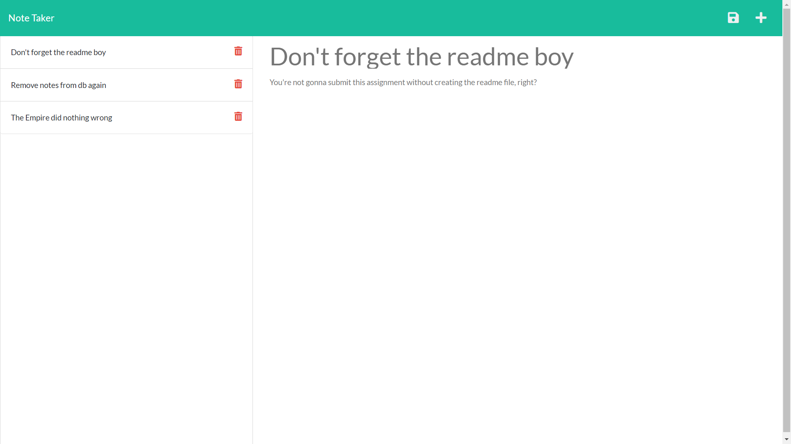

# Note Taker

## Purpose
This note taker allows you to enter and save notes. A title and text can be entered for each note, and both are saved by clicking the leftmost icon on the top-right. The rightmost icon deletes any unsaved text you've entered, allowing for something new to be entered instead.

## Website
https://infinite-stream-77988.herokuapp.com/

## Contributors
* HTML, CSS, and front-end JS by Xandromus and nol166
* Back-end JS by JEC6789